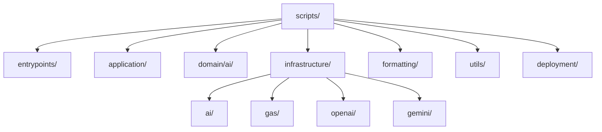
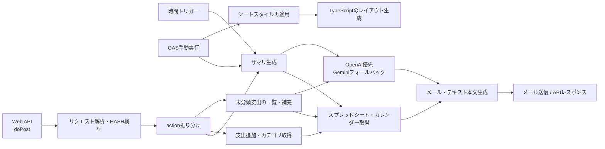

# 概要

## 全体構成

矢印は処理順ではなく、ディレクトリの包含関係を表します。

## ディレクトリと役割

| ディレクトリ | 役割 |
| --- | --- |
| [entrypoints](./entrypoints) | GASから直接呼ばれるWeb API、時間トリガー、手動実行の入口。 |
| [application](./application) | actionごとの処理を組み立てるユースケース層。 |
| [domain/ai](./domain/ai) | AIへ渡すプロンプトと入力の組み立て。 |
| [infrastructure](./infrastructure) | Spreadsheet、Calendar、OpenAI、Geminiなど外部サービスとの連携。 |
| [formatting](./formatting) | メール・テキストで返すサマリ本文の生成。 |
| [utils](./utils) | 日付計算、支出集計などの共通処理。 |
| [deployment](./deployment) | GitHub Actionsで使うclasp設定ファイルの生成。 |

## 主要フロー

### 処理別の入口と主なファイル

| 処理 | 入口 | 主なファイル |
| --- | --- | --- |
| Web API | `doPost` | [handleApi.js](./entrypoints/handleApi.js)、[apiCommon.js](./entrypoints/apiCommon.js) |
| 日次・週次・月次サマリ | API、時間トリガー、手動実行 | [expenseSummary.js](./application/expenseSummary.js)、[monthlySummary.js](./application/monthlySummary.js)、[summaryMessageFormatter.js](./formatting/summaryMessageFormatter.js) |
| 支出追加・カテゴリ取得 | API | [addExpenseRecord.js](./application/addExpenseRecord.js)、[fetchCategories.js](./application/fetchCategories.js) |
| 未分類支出の補完 | API、手動実行 | [uncategorizedExpenses.js](./application/uncategorizedExpenses.js)、[categorySuggestionAi.js](./infrastructure/ai/categorySuggestionAi.js) |
| シートスタイル再適用 | 手動実行 | [1_reapplySheetStyle.js](./entrypoints/1_reapplySheetStyle.js)、[src/layout/main.ts](../src/layout/main.ts) |

## ファイル別説明

## entrypoints

### [entrypoints/handleApi.js](./entrypoints/handleApi.js)

-   `doPost` で POST リクエストを受け付ける API の入口。

### [entrypoints/apiCommon.js](./entrypoints/apiCommon.js)

-   API リクエストの parse、hash 検証、action dispatch、JSON レスポンス生成を担当する。

### [entrypoints/0_manualEntryPoints.js](./entrypoints/0_manualEntryPoints.js)

-   GAS の UI から手動実行しやすいエントリポイントだけをまとめたファイル。

### [entrypoints/1_reapplySheetStyle.js](./entrypoints/1_reapplySheetStyle.js)

-   GAS の UI から `reapplySheetStyleManual` を実行し、既存の家計簿レイアウト、入力規則、条件付き書式をクリアしてから再構築する入口。

### [entrypoints/scheduledSummaryTriggers.js](./entrypoints/scheduledSummaryTriggers.js)

-   時間トリガーから日次・月次サマリーを起動する入口。

### [entrypoints/formatDateAndPriceNumbers.js](./entrypoints/formatDateAndPriceNumbers.js)

-   `onEdit` を利用して、日付と金額の列に修正があった際に必要に応じて自動でフォーマットを行う。

## application

### [application/addExpenseRecord.js](./application/addExpenseRecord.js)

-   `add` アクションによって実行される。
-   金額と内容を受け取って該当の日付の直下にデータを追加する。

### [application/fetchCategories.js](./application/fetchCategories.js)

-   `categories` アクションによって実行される。
-   `categories.js` 内のデータから名称一覧を返す。

### [application/expenseSummary.js](./application/expenseSummary.js)

-   `mail` または `text` アクションによって実行される。
-   日次・週次サマリーの実行フローを担当する。

### [application/monthlySummary.js](./application/monthlySummary.js)

-   月次サマリーの実行フローを担当する。

### [application/uncategorizedExpenses.js](./application/uncategorizedExpenses.js)

-   `list_uncategorized` アクションによって未分類支出の一覧を返す。
-   `autofill_uncategorized` アクションによって、OpenAI を優先し失敗時は Gemini でカテゴリ候補を推定して高信頼のものだけ更新する。

## domain/ai

### [domain/ai/expenseSummaryPrompts.js](./domain/ai/expenseSummaryPrompts.js)

-   日次・週次サマリー、カレンダーメモの意図分類・整形、節制モード判定などで使う AI プロンプト生成を担当する。

### [domain/ai/monthlySummaryPrompt.js](./domain/ai/monthlySummaryPrompt.js)

-   月次サマリー分析向けの AI プロンプト生成を担当する。

### [domain/ai/categorySuggestionPrompt.js](./domain/ai/categorySuggestionPrompt.js)

-   未分類支出のカテゴリ推定向け AI プロンプト生成を担当する。

## infrastructure/ai

### [infrastructure/ai/aiClient.js](./infrastructure/ai/aiClient.js)

-   OpenAI 優先、Gemini フォールバックのプロバイダ選択と共通ログ出力を担当する。

### [infrastructure/ai/aiResponseParsers.js](./infrastructure/ai/aiResponseParsers.js)

-   AI 応答のコードブロック除去や pipe 形式応答の解析を担当する。

### [infrastructure/ai/expenseSummaryAi.js](./infrastructure/ai/expenseSummaryAi.js)

-   日次・週次サマリー向けの AI 呼び出しフローと、カレンダーメモの意図分類・整形、記録済み予定判定を担当する。

### [infrastructure/ai/monthlySummaryAi.js](./infrastructure/ai/monthlySummaryAi.js)

-   月次サマリー向けの AI 呼び出しフローを担当する。

### [infrastructure/ai/categorySuggestionAi.js](./infrastructure/ai/categorySuggestionAi.js)

-   未分類支出のカテゴリ推定における AI 呼び出しと応答解析を担当する。

### [infrastructure/ai/weeklyAnalysisModeAi.js](./infrastructure/ai/weeklyAnalysisModeAi.js)

-   カレンダー予定から節制モード指定かどうかを AI で補助判定する。

## infrastructure/gas

### [infrastructure/gas/scriptRuntime.js](./infrastructure/gas/scriptRuntime.js)

-   stg / prod の実行時日付解決を担当する。
-   `TEST_DATE` が設定されていれば固定日付、未設定なら現在日付を返す。

### [infrastructure/gas/expenseSheetRepository.js](./infrastructure/gas/expenseSheetRepository.js)

-   日次・週次サマリー用の支出データを家計簿シートから取得する。

### [infrastructure/gas/monthlySheetRepository.js](./infrastructure/gas/monthlySheetRepository.js)

-   月次サマリー用の支出・収入データを家計簿シートから取得する。

### [infrastructure/gas/calendarRepository.js](./infrastructure/gas/calendarRepository.js)

-   Google カレンダー取得、前週予算差分メモの保存/取得、カレンダー関連の Script Properties 読み取りを担当する。

### [infrastructure/gas/uncategorizedExpenseRepository.js](./infrastructure/gas/uncategorizedExpenseRepository.js)

-   未分類支出の取得、カテゴリ更新、前月履歴の取得を担当する。

## infrastructure/gemini

### [infrastructure/gemini/geminiClient.js](./infrastructure/gemini/geminiClient.js)

-   Gemini API キー取得、モデル選択、`generateContent` 呼び出しの共通処理を担当する。

## infrastructure/openai

### [infrastructure/openai/openaiClient.js](./infrastructure/openai/openaiClient.js)

-   OpenAI API キー取得、モデル選択、Responses API 呼び出しを担当する。

## formatting

### [formatting/summaryMessageFormatter.js](./formatting/summaryMessageFormatter.js)

-   日次・週次サマリーの本文生成と `mail` / `text` の分岐を担当する。

### [formatting/monthlySummaryFormatter.js](./formatting/monthlySummaryFormatter.js)

-   月次サマリーの本文生成と送信処理を担当する。

## utils

### [utils/summaryDateUtils.js](./utils/summaryDateUtils.js)

-   週範囲計算、日付文字列変換などの日付 utility。

### [utils/expenseSummaryUtils.js](./utils/expenseSummaryUtils.js)

-   支出合計、カテゴリ別合計、ランキングなどの集計 utility。

### [utils/uncategorizedCommonUtils.js](./utils/uncategorizedCommonUtils.js)

-   未分類支出補完で使う共通 helper。

## デプロイ用スクリプト

### [deployment](./deployment)

-   GitHub Actions 上から利用されるスクリプト。
-   クレデンシャル情報を GitHub Secrets から取得した上で設定ファイルを生成する。
